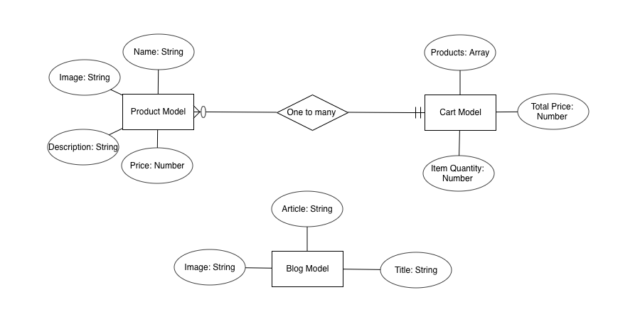

# Project 3 - Honey E-Commerce App
### --------------------------------------------------------------------------------------------
### Purpose

### --------------------------------------------------------------------------------------------
### Target End User

### --------------------------------------------------------------------------------------------
### GitHub Projects Link

### --------------------------------------------------------------------------------------------
### Heroku Deployed App Link

### --------------------------------------------------------------------------------------------
### Wire Frame Images
                                         

### --------------------------------------------------------------------------------------------
# ERD Image

### --------------------------------------------------------------------------------------------

