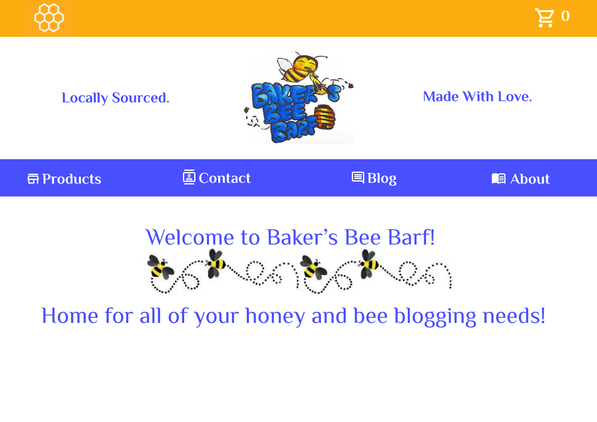
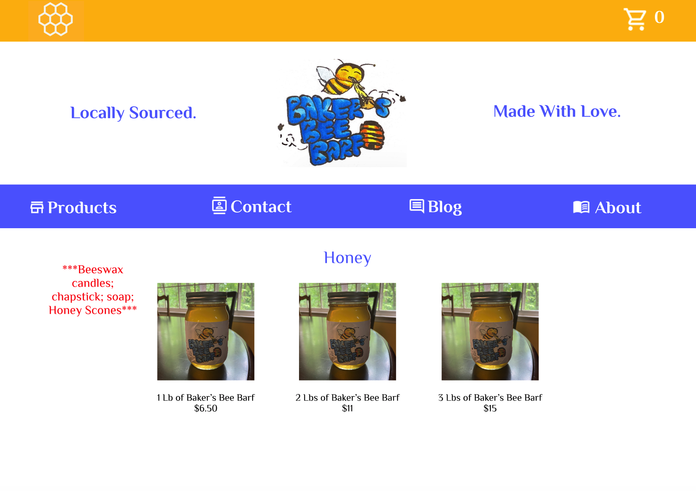
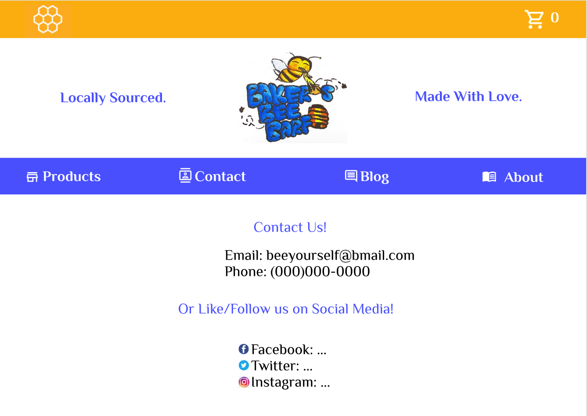
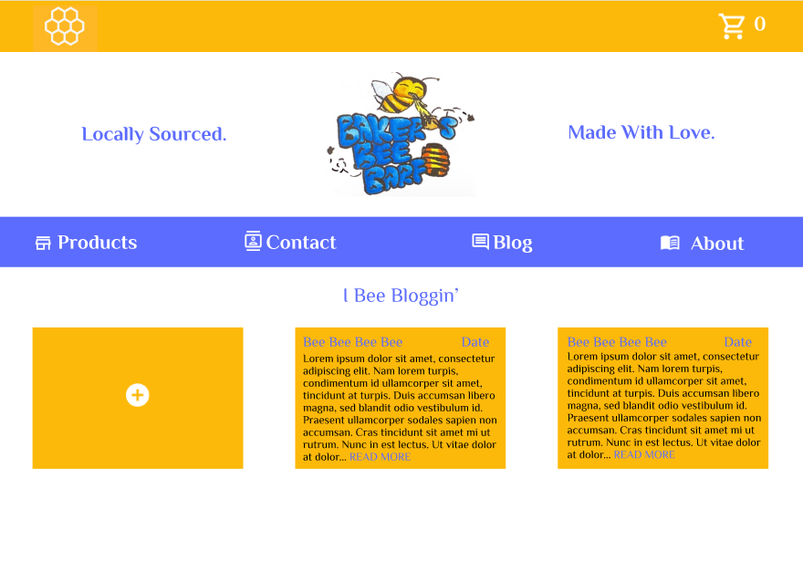
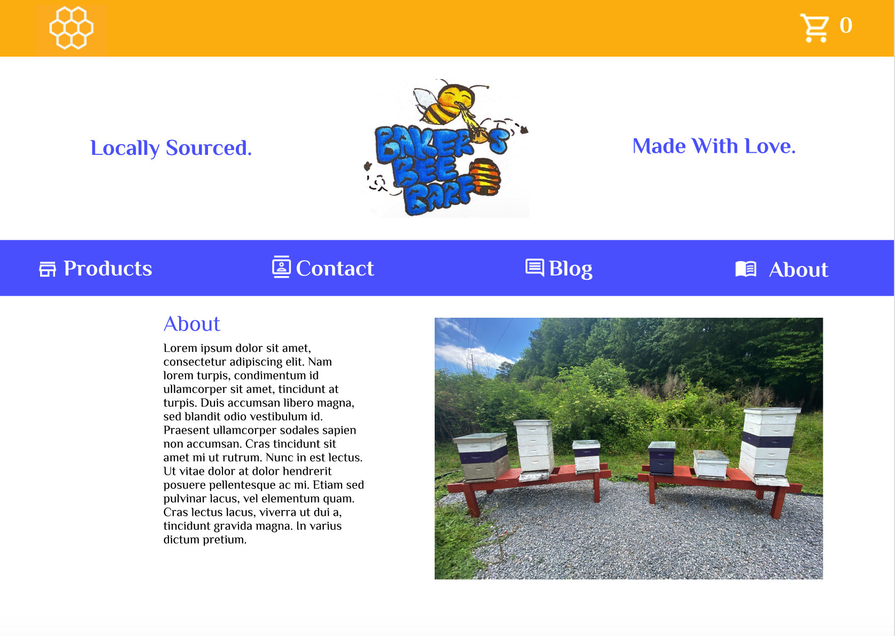
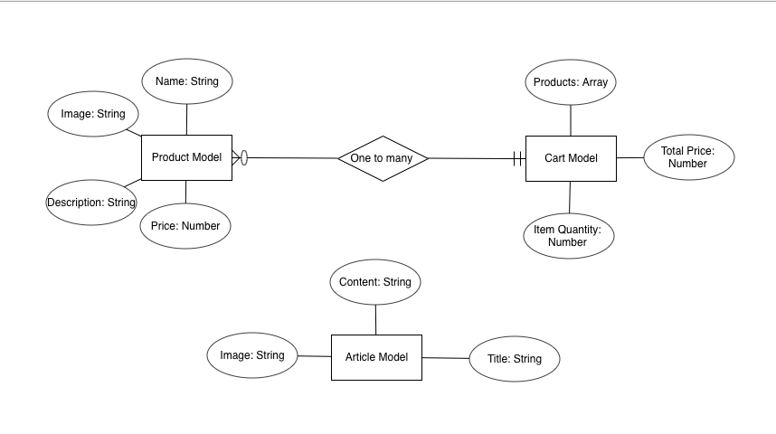

# Project 3 - Honey E-Commerce App
### --------------------------------------------------------------------------------------------
### Purpose
The problem is the lack of easy access to locally harvested honey, as well as peer information in how to harvest their own. This app for makes it easier for the user to view honey products, add them to their cart, and also view a blog that other users can write advice and articles on how to harvest honey or the current state of honey harvesting in the area. 
### --------------------------------------------------------------------------------------------
### Target End User
The Target End User is intended to be someone who wants to be able to get local honey, as well as read about what they themselves can do to bee-keep and harvest honey.
### --------------------------------------------------------------------------------------------
### GitHub Projects Link
[GitHub Projects Link](https://github.com/bakercharles14/project-3/projects/1)
### --------------------------------------------------------------------------------------------
### Heroku Deployed App Link
[Heroku App Link](https://bakers-bee-barf.herokuapp.com/)
### --------------------------------------------------------------------------------------------
### Wire Frame Images
                                         

### --------------------------------------------------------------------------------------------
# ERD Image

### --------------------------------------------------------------------------------------------

